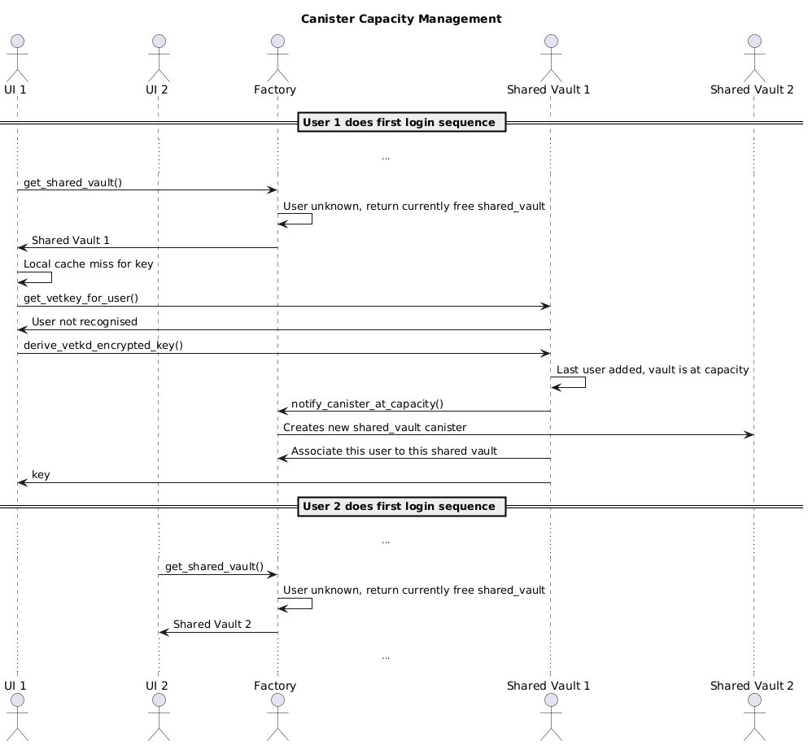

# Factory Canister

The **factory-canister** is the entry point into the GhostKeys vault system.
It is responsible for **creating and managing new vault canisters** (dedicated or shared) and acting as a **gateway** to existing vault instances. This design enables a scalable architecture where free-tier users can share a multi-tenant canister, while premium users are provisioned their own dedicated vault canisters.

---

## ✨ Purpose

* **Single entry point**: The factory canister is the first canister your frontend interacts with.
* **Canister lifecycle manager**: It can create new vault canisters on demand using the official released WASM builds.
* **Gateway**: It provides references to existing vault canisters (per-user or shared).
* **Upgrade-friendly**: Vault canister binaries are not embedded directly, but are dynamically fetched at build time from GitHub releases.

---

## 📦 Calls Architecture

---

## ⚙️ How it Works

1. On build, the script [`fetch_vault_release.sh`](./scripts/fetch_vault_release.sh) fetches the **latest vault and shared vault canister WASMs** and corresponding `.did` files from the [GhostKeys-App/vault-canister](https://github.com/Ghostkeys-App/vault-canister) GitHub releases.

   * Default tag: `shared-canister-dev-v0.3.0`
   * Override with:

     ```bash
     export VAULT_RELEASE_TAG=my-custom-tag
     ```
   * If `.did` files are missing in the release, they are generated automatically using `candid-extractor`.

2. The build pipeline (`dfx.json`) then compiles the factory backend:

   * Fetches vault releases (WASM + DID)
   * Builds `factory-canister-backend` in release mode
   * Extracts candid from the built WASM

3. At runtime, the factory canister can:

   * On init factory spawns **new shared canister**
   * Spawn **new vault canisters** from the downloaded WASM
   * Provide access to the **shared vault canister**
   * Expose a consistent API surface to the frontend

---

## 📦 Installation

### Pre-requisites

* [DFX SDK](https://internetcomputer.org/docs/current/developer-docs/setup/install)
* Rust nightly with `wasm32-unknown-unknown` target
* `candid-extractor` installed (for `.did` fallback)

```bash
rustup target add wasm32-unknown-unknown
cargo install candid-extractor
```

If you want control over spawned canisters at runtime, add `init_arg` to your `dfx.json`:

```json
"init_arg": "(opt record { admin = opt principal \"<your-principal-id>\" })"
```

---

## 🚀 Running Locally

Start the local replica and deploy:

```bash
dfx start --background
dfx deploy
```

Your factory canister will be deployed, and accessible at:

```
http://localhost:4943?canisterId={factory_canister_id}
```

---

## 🔍 Repository Layout

* **`dfx.json`** – Defines build pipeline:

  * Runs `fetch_vault_release.sh`
  * Compiles `factory-canister-backend`
  * Extracts `.did` definitions
* **`src/factory-canister-backend`** – Rust implementation of the factory logic
* **`scripts/fetch_vault_release.sh`** – Pulls vault and shared-vault artifacts from GitHub releases
* **`target/wasm32-unknown-unknown/release`** – Output WASMs for factory and vault canisters

---

## 🛠 Example Usage

Deploying locally you would see following output:

```bash
Deploying all canisters.
Created a wallet canister on the "local" network for user "test2" with ID "uqqxf-5h777-77774-qaaaa-cai"
factory-canister-backend canister created with canister id: uxrrr-q7777-77774-qaaaq-cai
Building canister 'factory-canister-backend'.
Executing 'bash ./scripts/fetch_vault_release.sh'
[fetch] Downloading WASMs from release shared-canister-dev-v0.2.1…
[fetch] Downloading DIDs (if present in release)…
[fetch] OK.
Executing 'cargo build --target wasm32-unknown-unknown --release -p factory-canister-backend --locked'
   Compiling factory-canister-backend v0.1.0 (/Users/kostiantynmatvieienkov/projects/mine/vault/factory-canister/src/factory-canister-backend)
    Finished `release` profile [optimized] target(s) in 1.44s
Executing 'candid-extractor target/wasm32-unknown-unknown/release/factory_canister_backend.wasm > src/factory-canister-backend/factory-canister-backend.did'
⠠ Installing canisters...
⠤ Installing code for canister factory-canister-backend, with canister ID uxrrr-q7777-77774-qaaaq-cai                                                                        2025-08-24 14:31:38.286608 UTC: [Canister uxrrr-q7777-77774-qaaaq-cai] Factory canister initialized
Installed code for canister factory-canister-backend, with canister ID uxrrr-q7777-77774-qaaaq-cai
Deployed canisters.
URLs:
  Backend canister via Candid interface:
    factory-canister-backend: http://127.0.0.1:4943/?canisterId=u6s2n-gx777-77774-qaaba-cai&id=uxrrr-q7777-77774-qaaaq-cai
kostiantynmatvieienkov@KostiansMacBook factory-canister % 2025-08-24 14:31:39.863683 UTC: [Canister uxrrr-q7777-77774-qaaaq-cai] Running init_create_shared_vault
2025-08-24 14:31:39.863683 UTC: [Canister uxrrr-q7777-77774-qaaaq-cai] Creating a new shared vault
2025-08-24 14:31:42.875827 UTC: [Canister uxrrr-q7777-77774-qaaaq-cai] Created shared vault with ID: uzt4z-lp777-77774-qaabq-cai
2025-08-24 14:31:42.875827 UTC: [Canister uxrrr-q7777-77774-qaaaq-cai] Completed init_create_shared_vault
```

---

## 📚 References

* [Internet Computer Quick Start](https://internetcomputer.org/docs/current/developer-docs/setup/deploy-locally)
* [Rust Canister Development Guide](https://internetcomputer.org/docs/current/developer-docs/backend/rust/)
* [ic-cdk](https://docs.rs/ic-cdk)
* [candid](https://internetcomputer.org/docs/current/developer-docs/backend/candid/)

---

## 📝 Notes

* By default, the script fetches release `shared-canister-dev-v0.3.0`. Always ensure the correct release is tagged in your CI/CD pipeline.
* If building from source only, you may skip the fetch script, but then must provide local copies of `shared_vault_canister_backend.wasm`, `vault_canister_backend.wasm` and `.did` files.

---
